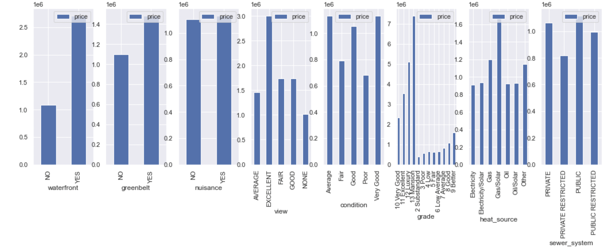
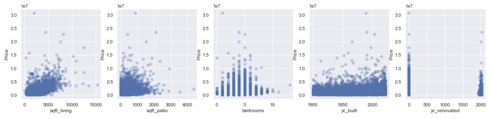
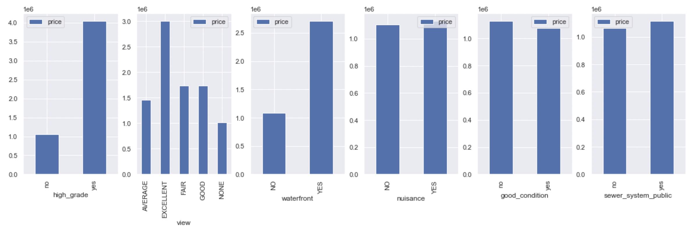
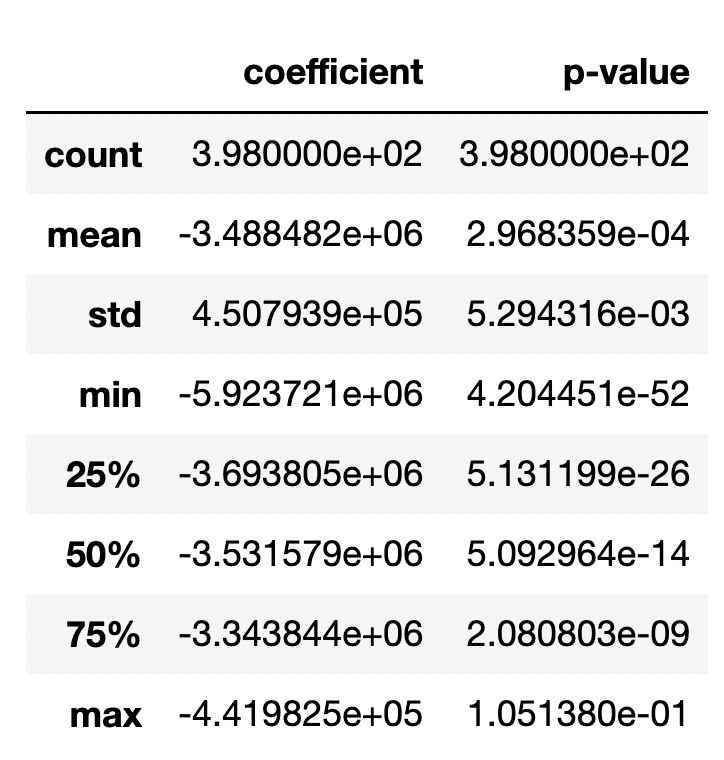
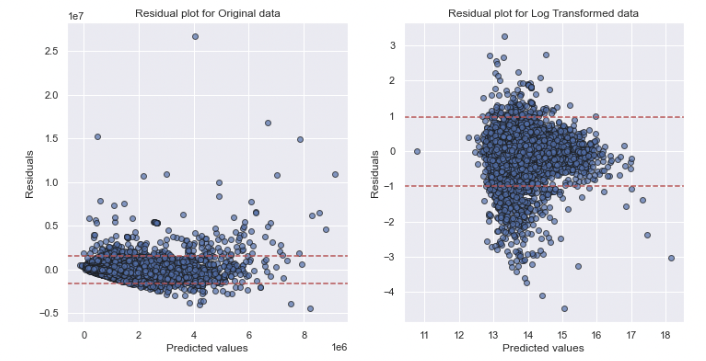

# Real Estate Analysis

## Overview
The real estate market has seen significant fluctuations over the past two years, with many factors affecting housing prices. With such volatility, it has become increasingly important for both buyers and sellers to have accurate predictions of housing prices in order to make informed decisions.

An effective way to accomplish this is through the use of predictive models that take into account various factors, such as location, square footage, number of bedrooms and bathrooms, and other categorical features that may impact housing prices. By analyzing data from past housing transactions and creating models based on these factors, it is possible to predict the likely selling price of a house with a certain degree of accuracy.

Such models can be useful for a variety of purposes, from helping home buyers make informed decisions about which properties to consider, to helping real estate professionals set appropriate listing prices for their clients' homes. While no model can predict the exact price of a home with 100% accuracy, these predictive tools can provide valuable insights into the factors that influence housing prices and help both buyers and sellers navigate the complex and ever-changing real estate market.

## Business Understanding

King of the Deck, a deck design company, has requested that we conduct research for them. They are considering expanding their business to indoor renovations as well. They want to know given a certain amount of space to renovate if it's a better investment to create an outdoor deck or indoor living space. We are tasked with creating a model that predicts house prices, and within that model seeing the affect of each extra square foot of deck space vs living space on overall house price.

Photo by <a href="https://unsplash.com/photos/f9qZuKoZYoY">Avi Waxman</a> on <a href="/@grstocks">Unsplash</a>

## Data Understanding
 
Most of our data was pulled from <a href="https://info.kingcounty.gov/assessor/DataDownload/default.aspx">King County Assessor Data Download</a> 

We begin by loading and then previewing our data

Our data is different numeric and categorical statistics or describers of houses. Each row in the data represents one house. Our target factor(aka y variable) in the data set is price. For all the other columns we will be looking to see it's affect on price. Many of the columns describe square footage of different areas in a house. Others describe when it was built, quality, address, and various other descriptive statistics.

With a brief scan of some of the addresses it seems that all of the houses are in the United States. However, let's right a short code to confirm this

As we assumed, all the data is indeed from the USA

Now lets take a further look into the statistics within each numerical row

First thing to note is that we have a pretty large sample size, over 30k houses.

If we look at the min and max in the yr_built column we see that the data frame is of houses built between 1900-2022.

Let's see when the houses were sold

We see that all the houses were sold in 2021 and 2022

## Data Preparation

Let's pull up the info of the data, and to see if there are any missing values

We see that there are 2 columns with missing values let's just drop the rows with missing values, as is it not even .01% of the data

## Data Analysis and Modeling

We will begin our data analysis by finding the variable that has the highest correlation with out target variable, `price`. We will attempt to create the best possible model at predicting the price. Once we have that we will determine the affect each extra square foot of patio has on the price of the house.

First, let's pull up a correlation matrix of all the data.

Now lets create a heatmap to see if we can get a better view

There is still too much going on in both of those, so let's pull up the correlations within the price column alone.

Unsurprisingly price is 100% correlated with itself. The variable with the strongest correlation with price is sqft_living with a value of .61. This column describes the total square footage of living space in the home. It is quite logical that this is the highest correlated factor, as in general the bigger the house is, the more it will sell for.

### Single Variable Regression Model

Lets create a basic regression model with the highest correlated value. We should keep in mind that this could also be a negative number(although in this case it clearly isn't). With a correlation value of .61 we shouldn't expect such a great model, as although this doesn't illustrate some significance, it is nowhere near perfect

First we will pull up a scatter plot showing the relationship between `sqft_living` and `price`. In plotting this scatterplot, I encountered an error message; with some interet research I found an import statement that can be used as a workaround. To see more about the issue <a href="https://stackoverflow.com/questions/55109716/c-argument-looks-like-a-single-numeric-rgb-or-rgba-sequence">click here</a>

There seems to be some sort of upward trend with a few outlier values, both on the x and y axes.

Now, let's move on to create the actual model. We will first set price as our target value, and then sqft_living as our X value for our first model. Then we will use methods from statsmodels to create the model. Finally we will pull up the summary stats. 

Now we will calculate the baseline mean absolute error, and then we will give an analysis of our model.

`sqft_living` was the attribute most strongly correlated with price, therefore our model is describing this relationship.

Overall this model is statistically significant and explains about 37% of the variance in price. Although there is some significance to this number, there definitely is room to improve.
In a typical prediction, the model is off by around $396k. 

- The intercept is at about -\\$76k. This means that a house with 0 square feet of living area  would sell for -\$76k. It is fine that this value doesn't make sense as there is no such thing as a house that is 0 square feet. 
- The coefficient for sqft_living is about \\$560. This means for each additional square foot of living area, the house price increase by $560.

### Adding Other Factors
In hopes of creating a better model we will add in other numerical factors. However, we want to make to sure to avoid multicollinearity, meaning that one factor shouldn't be a good predictor of a different factor. To avoid this we will pull up the correlation between all numerical factors with eachother. The ones with correlation above .7 we won't use. 

The code for this was taken from the from the curriculum on <a href="https://github.com/learn-co-curriculum/dsc-multicollinearity-of-features">this</a>  github page.

It seems that we should either use long or lat if we plan on using any of them, and probably better to only use one of: sqft_above, sqft_living, bathrooms, as there is high multicollinearity between these values. Since sqft_living is the highest correlated with price we will stick with that.

So let's reload the correlation values, and create a new model with the values that aren't highly correlated with eachother.

Our new X value is all of the numerical factors, except for sqft_above, bathrooms, sqft_lot, long, lat, and id. In other words we are using: `sqft_living`, `sqft_patio`, `bedrooms`, `sqft_garage`, `sqft_basement`,`floors`, `yr_built`, `yr_renovated`. 

Our new model is describing the relationship between most of the numerical factors and price.

Overall the model is still statistically significant and is slightly better than the last as it explains 40.3% of the variance in price. This number still isn't great, and could use some improvement. 

All of the individual parts of the model are still statistically significant.

- The model is off by slightly less then the last one, as the MAE is now \\$381K. 
- The constant has had a drastic change and is now roughly \\$5.6 million. Again, it is fine that this number doesn't make sense, as there is no such thing as a house with 0 sqft.
- The coefficient:
    - `sqft_living`:     644.1443.
    - `sqft_patio`:      264.3368   
    - `bedrooms`:      -1.477e+05   
    - `sqft_garage`:     -52.7882   
    - `sqft_basement`:    28.4341    
    - `floors`:         7.007e+04   
    - `yr_built`:      -2780.7161    
    - `yr_renovated`:     66.2543
    
The values for all the factors except for `bedrooms`, `sqft_garage`, and `yr_built` are all quite reasonable, in that they are positive. Meaning, that usually when you have more square feet in a certain area, more floors, or a newly renovated house the price goes up. However, in general adding extra bedrooms, a larger garage, or a newer house causes the price to go up although this model seems to indicate the opposite. This is a clear sign that the model can use some improvement.

Let's create a row that gives us the age of the house when it was sold to see if this is a better predictor then `yr_built`

When we tweak our model to compate `age` and `yr_built` we see that the adjusted r-squared values are the same. As such we will stick with our original model which includes `yr_built`

If we play around with the data a bit, we can create a column that gives the amount of floors per lot size that may have a slightly positive impact on our model, that we can use later on

It is probably fair to assume that address doesn't have much of an affect on the price, and we already used date so lets check out other variables.

Let's begin by pulling up histograms of all the categorical factors to see which ones seem to have a strong variance in price based on each value. When loading the histograms, I got a 'SettingWithCopyWarning', as a quick fix I googled an import code to remove this warning. To see more about the issue <a href="https://www.dataquest.io/blog/settingwithcopywarning/">click here</a>

Upon examining the graphs we find some useful information:

- Everything seems to have atleast a slight variance across each of it's individual values.
- Looking at the y-axis, `grade` seems to be the most significant, followed by `view` and `waterfront`. 

So lets start with grade, and one hot encode new dummy values

Since grade_2Substandard is the worst level, we will drop it, and use it as the baseline

Now, we create our first model with a categorical value

Our model as a whole is statistically significant, and the adjusted r squared has increased from 40.3% to 48.7%

However, all the coefficients for grade that are below 11 are not statistically significant.

So let's try engineering a new feature that is only the higher level grades. We will create a new row called high_grade that will say "yes" if the grade is 11 or up, and "no" if the grade is below 11. We will then create new dummy values and run a new model with our new column instead of grade

Although, this model has a slightly lower adjusted r squared then the previous model, at only 44.1%, it is still much better then our original model. Additionally, all the variables are now statistically significant.

Lets pull up the value counts to see if there is a significant number of higher grade houses.

We see that since there is such a small amount of high graded houses, grade only becomes a significant factor for houses with grades 11-13.

Let's add in view now, to see how it affects our model

Now that is a significantly better adjusted r-squared at 46.8% and all of our values our significant.

However, lets check out the value counts to see if there is a significant amount of data.

Since roughly 90% of the data has no view this factor only becomes significant when a house has a view.

Instead of going through each categories value counts one by one, lets just pull them up now, to see which one has a fair distribution of values

Let's break the sewer_system column down into 2 values, that say whether it's public or private. Additionally let's break down the condition column into 2 values, whether it is atleast in "good" condition.

Now we will create and run our new model this will include: `sqft_living`, `sqft_patio`, `bedrooms`, `yr_built`, `yr_renovated`, `high_grade`, `view`, `waterfront`, `nuisance`, `good_condition`, `sewer_system_public`

Now we have our highest adjusted r² is it's highest yet at 48.1% and all the p values for coefficients are significant

Using some basic googling and common knowledge it seems like one of the main factors in price is location. As such let's create a new column that isolates the zipcode. We will do use by using the str method on the address column.

We'll re run the same model just now including our new column `zipcode`

## Final Model results

Although we may do some slight tinkering with the model after this(ex: scaling, centering, or other minor changes) this will be our final model.

### Data Understanding and Preparation

Our final model included these factors:

   - `sqft_living` 
   - `sqft_patio` 
   - `bedrooms`
   - `yr_built` 
   - `yr_renovated`
   - `high_grade`
   - `view` 
   - `waterfront` 
   - `nuisance`
   - `good_condition`
   - `sewer_system_public`
   - `zipcode`
    
We performed data cleaning on the data frame as a whole and removed a small amount of columns with missing values. We also created new factors based on the given ones, by categorizes houses with grades 11 and up with a high grade. We also grouped the condition column into 2 groups, based on whether it had atleast a good condition. We also group the sewer system into, 2 groups whether it was public or private. Then we one-hot encoded `high_grade`, `view`, `waterfront`, `nuisance`, `good_condition`, `sewer_system_public`, `zipcode`, resulting in 9 dummy predictors, not including the dummy predictors for each zipcode.

We will now pull up scatterplots and bar charts of our factors:

### Model Metrics

These features were fed into an ordinary least-squares multiple regression model. This model:

- is statistically significant overall (F-statistic p-value 0.00)
- explains about 65% of the variance in Price (adjusted R-Squared 0.654)
- is off by about \\$257K in an average prediction (MAE 256787.05)

### Model Interpretation

Below are all model coefficients and p-values(again excluding zipcode as there are far too many):

And here are summary statistics of the zipcode coefficients:

To summarize:

The constant:
- For a house  with 0 `sqft_living` and `sqft_patio` area, as well as 0 `bedrooms`. Thats `yr_built` and `yr_renovated` are 0(meaning it was built in 1900 and never renovated. With a house `grade` below 11, no `view`, not on a `waterfront`, with no traffic or other `nuisance`, in below good `condition`, that uses a private `sewer_system`, will have a value just around \\$3 million.
    - Again, it is fine that this number doesn't make sense, as there is no such thing as a house with 0 sqft, etc.

The coefficients:
- `sqft_living`              394.8094
    - For an increase in 1 square foot of living area, price increases by \\$395.
- `sqft_patio`                 85.6320
    - For an increase in 1 square foot of patio area, price increases by \\$86.
- `bedrooms`               -4.617e+04
    - This means that for every bedroom in a house there is a decrease in price of around \\$46k. As we mentioned earlier this value is quite strange, as bedrooms has a positive relationship with price. Although we already tested for high correlation between features, this negative number may be a result of some sort of bedrooms being correlated with other predictor variables in the model that also have an effect on price, and the negative coefficient for 'bedrooms' is capturing the joint effect of these variables.
- `yr_built`                 436.9200
    - For every increase in year above 1900 the price goes up by \\$436. In other words the newer the house is the more it will cost.
- `yr_renovated`               46.3294
    - Similar to the year the house was built, the newer the renovation done on the house the more it will cost.
- `high_grade_yes`           1.067e+06
    - This category is indicating whether the house has a grade of 11 or above. Grades 11-13 indicate whether it's "Excellent", "Luxury", or "Mansion". If it is in one of these categories the price will go up by over \\$1 million dollars.
- `view_AVERAGE`             8.003e+04
- `view_EXCELLENT`           8.135e+05
- `view_FAIR`               1.913e+05
- `view_GOOD`                 1.53e+05
    - These next 4 are describing the relationship that the houses view has on its price. They are all being compared to houses with no view at all. If the house does have a view from "Average" to "Excellent", this price will go up by \\$80k-\\$813k on average.
- `waterfront_YES`           7.651e+05
    - Whether the house is on a waterfront will also have a major impact on it's price, and on average will cause a price increase of \\$765k.
- `nuisance_YES`            -3.967e+04
    - Whether the house has traffic noise or other recorded nuisances will cause the price of the house to drop by \\$40k on average. 
- `good_condition_yes`       5.201e+04
   - Whether the overall condition of the house it good or better, in terms of its maintenance will cause the house price to increase by \\$52k on average.
- `sewer_system_public_yes`  2.419e+04  
    - Whether the house uses a public sewer system in comparison to a private one will increase it's value on average by \\$24k. 
- `zipcode` ranged from -\\$441k to -\\$5.9 million
    - All these zipcodes were compared to zipcode 99504, and have a negative slope in comparison

All the coefficients in the model were statistically significant except for one zipcode. Most of the coefficients is this model are quite logical, that they are positive vs negative. The only major standout is bedrooms, in that more bedrooms is generally viewed as having a positive impact on the houses price. The combination of this coefficient, a MAE of \\$257k, and an adjusted r&sup2; not quite close enough to 1, indicates there is still room for improvement of the model. Perhaps given other data about the neighborhood of the houses, proximity to houses of worship, details whether the house is more kid friendly, etc. could allow us to create a more accurate model.

## Data Transformations

Now let's move on to some minor data transformations to see if the data is more interpretable this way:

### Centering

Centering won't help us, as there are many non continuous variables.

### Standardizing

Although standardizing includes centering, it can give us useful information about the magnitude of our numeric factors and which one has the greatest affect.

What comes out is that a one standard deviation increase in:  
    - `sqft_living` will lead to a \\$384k increase in price  
    - `sqft_patio` will lead to a \\$21k increase in price
    
### Model diagnostics

We will analyze the model to make sure it passes all the assumptions of linear regressions.

### 1. Linearity

Below are partial regression plots for all model features except for zipcode(as there are too many):

Most of the data is not looking very linear. Let's just do a linear rainbow test to confirm this.

The p-value is well below an alpha level of .05. As such we can reject the null, and say that indeed the data is not very linear.

To solve this issue let's try doing a log transformation of our data reduces the order of magnitude, making the higher values lower and lower values higher, it also should undo exponentiation.

Let's log transform our target variable

### Log Transformed Model Analysis

Notable differences with our new model:

- Our new model now explains about 68%(adjusted R-Squared 0.681) of the variance in Price while our old model was only around 65%.
- Our model as a whole is statistically significant as well as the constant. However, a small minority of our coefficients are no longer statistically significant. These include: `bedrooms`, `sewer_system_public_yes`, and a small number of zipcodes. 
- There is a new way to interpret slope:
    - For ex: For each increase of 1 unit in `sqft_living`, we see an associated positive change of .03% in house price.
    - For each increase of 1 unit in `sqft_patio`, we see an associated positive change of .006% in house price.
- The new MAE is .2. This is interpreted as:
    -  on average the model's predictions are off by a factor of e^(0.2) = 1.22, which corresponds to a 22% error in the target variable values.

Now, let's try running a new linear rainbow test to see how linear the data is

With a p-value of .96 we do not have nearly enough evidence to reject the null(that the data is linear), so we will conclude that our data is probably linear.

### 2. Independence

We already made sure to not use factors with high correlation with eachother. Nonetheless we will pull up the code again here. Again we will use a cutoff correlation of .7.

Since we have only used `yr_built` and `sqft_living`. Thus we have no issues of multicollinearity.

### 3. Normality

To check for this lets pull up the distribution of our `iterated_results6` and then the distribution of `log_results`

This histogram looks much more normal. Let's run a Q-Q plot to confirm its normality. 
This method compares two probability distributions by plotting their quantiles against each other.

We will use the Q-Q plot to compare our data to a normal distribution of data. When examining the Q-Q plot we want the data points to follow the diagonal line as closely as possible.

As we saw in the original histogram, the original distribution of `price` has a strong skew to the right. Although the log transformed value isn't perfect it seems close to normal, as most of the values within 2 standard deviations of the mean are very close to the red line.

### 4. Equal Variance: Homoscedasticity

We are hoping that our data is Homoscedastic, meaning that the variable's variability is equal across the range of values of the predictor.

Both plots are not looking very homoscedastic. However, we will run Breusch-Pagan tests on both to confirm this

For both of our models we reject the null hypothesis and thus assume that both models are heteroscedastic. 

### Patio Statistics

Lets pull up some summary patio statistics so we can give adequate advice about patio size.

We see that overall houses with patios cost more than houses without. Additionally the median patio size compared to living area is around 10% and median patio size compared to lot size is around 3%

## Conclusion

We will now sum up the analysis, and give our advice to the stakeholder based on our model. 

After our final analysis we had 2 options for our final model. The first option was the non log transformed version and the second was log transformed. 

1. Adjusted r squared:
    - The original model explained 65%(adjusted R-Squared 0.654) of the variance in price.
    - The log transformed model now explains about 68%(adjusted R-Squared 0.681) of the variance in price.
2. Statistical significance of model:
    - Both models were statistically significant as a whole.
3. Statistical significance of constant and coefficients:
    - The original model has the constant as well as all the coefficients being statistically significant, except for one coefficient of a `zipcode`.
    - The log transformed model has the constant and most of the coefficients being statistically significant. However, the coefficients for `bedrooms`, `sewer_system_public_yes`, and a small number of `zipcodes` are no longer significant.
4. Mean Absolute Error:
    - The mean absolute error for our original model is \\$257k, which means that on average the models predictions are off by \\$257k.
    - The mean absolute error for our log transformed model is .2 which means that on average the model's predictions are off by 22% in the target variable values.
5. LINE (Linearity, Independence, Normality, Equal Variance) Assumptions
    - Our original model is not linear, normal, and is heteroscedastic, meaning it lacks equal variance. However, there is not much multicollinearity issues as each factor is not very dependent on the other factors.
    - Our log transformed model is linear, normal, has minimal multicollinearity; however, it is also heteroscedastic.
    
Overall, the log transformed model is slightly better; however, there is a slight trade off in the interpretability. In our original model an addition of one square foot in patio area leads to a \\$86 increase in price while an addition square foot of living space leads to a \\$395 
increase in price. In our log transformed model the coefficients are read as an increase of one square foot of patio space is associated with a increase of .006% in house price. While an increase of one square foot of living space, will be associated with a .03% in house price.

## Recommendations

Unfortunately for King of the Deck it seems as though adding patio space over living space is not recommended. Although there are many other factors involved house prices of those with patios are higher than those without patios. Additionally, we saw from our model that adding patio space over nothing at all does add to the house price. Therefore we recommend that they expand their business to include home renovations, as it is more profitable. However, it is recommended to add some sort of patio to the house as it will increase price. In terms of the size of the patio, they should build patios that are around 10% the square footage of the living area and around 3% of the lot area.

## Limitations

As noted earlier, both our final models had an adjusted r&sup2; below .7 as well as mean absolute errors that were each respectively quite high. Both of these indicate that these are not the best models and there is definitely room for improvement

## Next steps

Being that the model could use improvement, we more need more data to better to predict house prices. 
Given more data about:
                                             
1. Proximity to house of worship
2. Proximity to parks
3. Does the house have a pool
4. Square footage of green area/ usable outdoor are of the house
5. Landscaping quality
6. Does the house have a basketball hoop or private courts
7. Family friendly house
8. Family friendly neighborhood
9. Social and Economic factors at the time of sale

I believe given such information we can create a much more accurate model.

