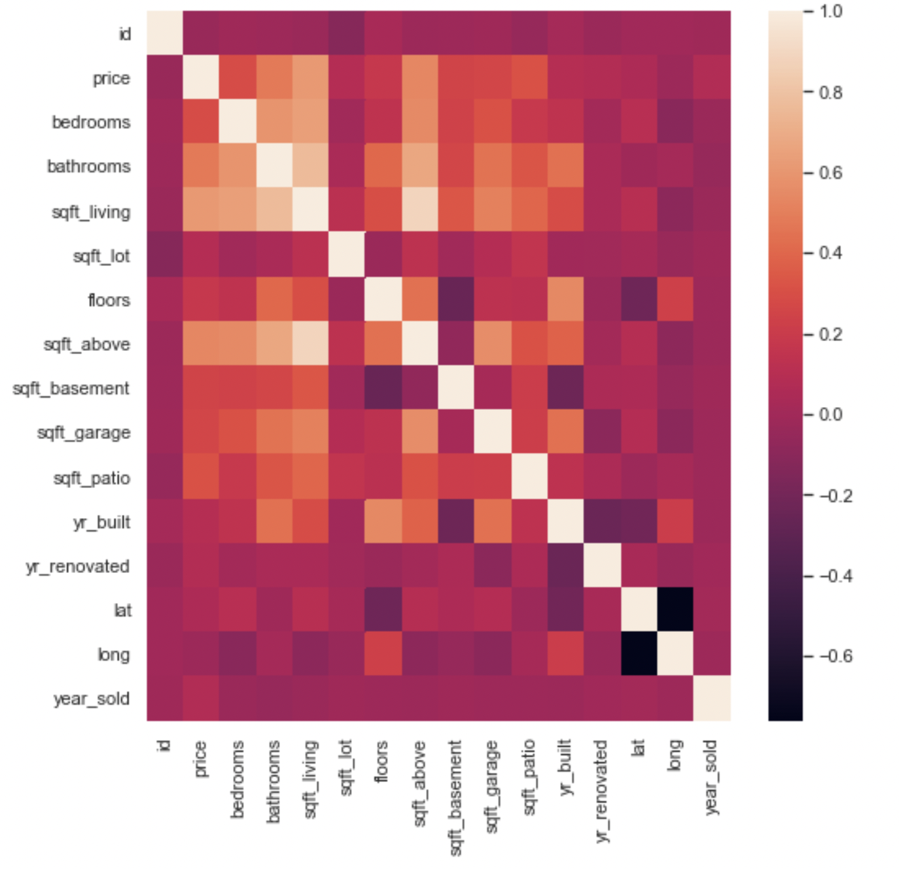
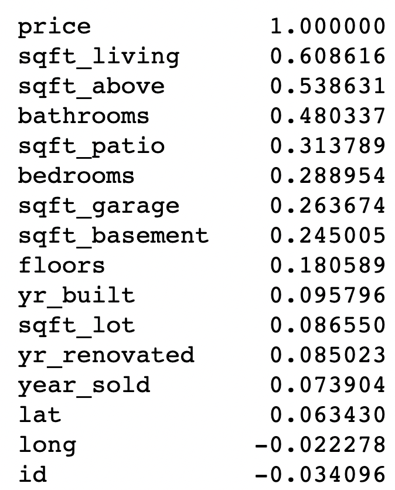

Overview(what should be done in first 2 steps)
Business and Data Understanding
    Explain your stakeholder audience here
Modeling
Regression Results
Conclusion

# Real Estate Analysis

## Business Understanding

King of the Deck, a deck design company, has requested that we conduct research for them. They are considering expanding their business to indoor renovations as well. They want to know given a certain amount of space to renovate if it's a better investment to create an outdoor deck or indoor living space. We are tasked with creating a model that predicts house prices, and within that model seeing the affect of each extra square foot of deck space vs living space on overall house price.

Photo by <a href="https://unsplash.com/photos/f9qZuKoZYoY">Avi Waxman</a> on <a href="/@grstocks">Unsplash</a>

## Data Understanding
 
Most of our data was pulled from <a href="https://info.kingcounty.gov/assessor/DataDownload/default.aspx">King County Assessor Data Download</a> 

import pandas as pd 
import seaborn as sns
import matplotlib.pyplot as plt
%matplotlib inline
import statsmodels.api as sm
import numpy as np
import scipy.stats as stats
from sklearn.metrics import mean_absolute_error
from sklearn.preprocessing import StandardScaler

We begin by loading and then previewing our data

Our data is different numeric and categorical statistics or describers of houses. Each row in the data represents one house. Our target factor(aka y variable) in the data set is price. For all the other columns we will be looking to see it's affect on price. Many of the columns describe square footage of different areas in a house. Others describe when it was built, quality, address, and various other descriptive statistics.

With a brief scan of some of the addresses it seems that all of the houses are in the United States. However, let's right a short code to confirm this

As we assumed, all the data is indeed from the USA

Now lets take a further look into the statistics within each numerical row

First thing to note is that we have a pretty large sample size, over 30k houses.

If we look at the min and max in the yr_built column we see that the data frame is of houses built between 1900-2022.

Let's see when the houses were sold

We see that all the houses were sold in 2021 and 2022

## Data Preparation

Let's pull up the info of the data, and to see if there are any missing values

We see that there are 2 columns with missing values let's just drop the rows with missing values, as is it not even .01% of the data

## Data Analysis and Modeling

We will begin our data analysis by finding the variable that has the highest correlation with out target variable, `price`. We will attempt to create the best possible model at predicting the price. Once we have that we will determine the affect each extra square foot of patio has on the price of the house.

First, let's pull up a correlation matrix of all the data.

Now lets create a heatmap to see if we can get a better view

There is still too much going on in both of those, so let's pull up the correlations within the price column alone.

