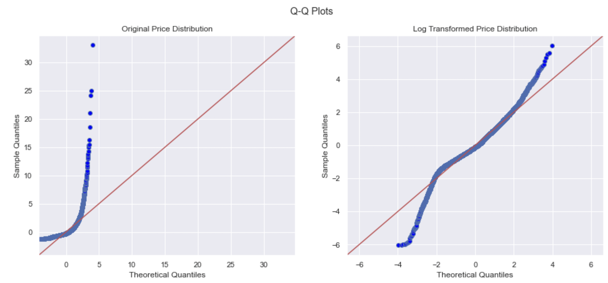
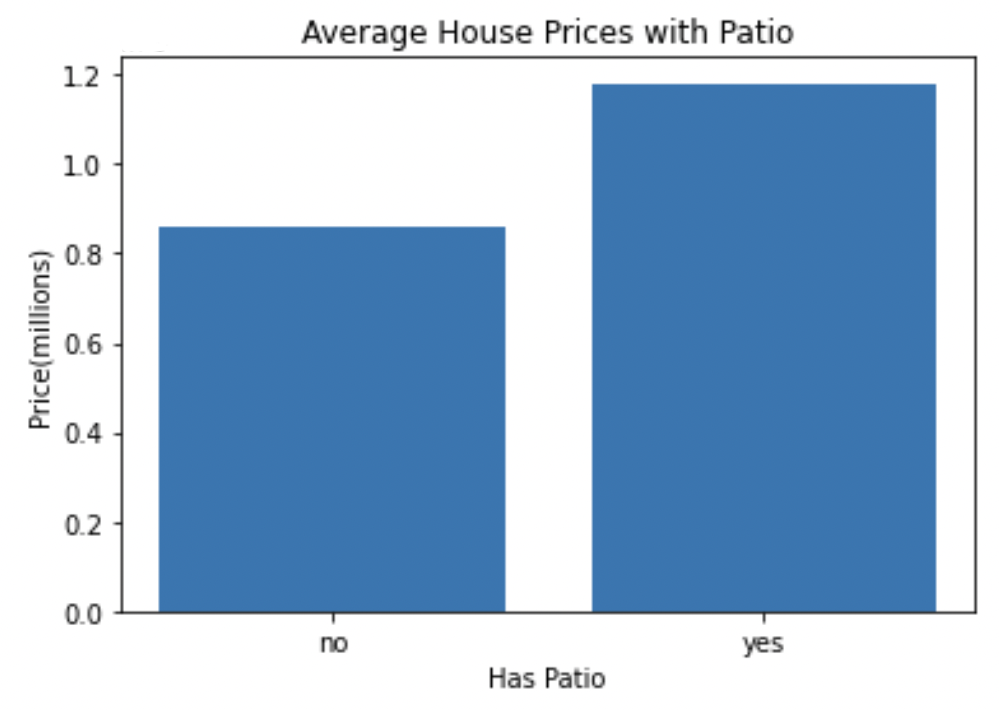

# Real Estate Analysis

## Overview
The real estate market has seen significant fluctuations over the past two years, with many factors affecting housing prices. With such volatility, it has become increasingly important for both buyers and sellers to have accurate predictions of housing prices in order to make informed decisions.

An effective way to accomplish this is through the use of predictive models that take into account various factors, such as location, square footage, number of bedrooms and bathrooms, and other categorical features that may impact housing prices. By analyzing data from past housing transactions and creating models based on these factors, it is possible to predict the likely selling price of a house with a certain degree of accuracy.

Such models can be useful for a variety of purposes, from helping home buyers make informed decisions about which properties to consider, to helping real estate professionals set appropriate listing prices for their clients' homes. While no model can predict the exact price of a home with 100% accuracy, these predictive tools can provide valuable insights into the factors that influence housing prices and help both buyers and sellers navigate the complex and ever-changing real estate market.

## Business Understanding

King of the Deck, a deck design company, has requested that we conduct research for them. They are considering expanding their business to indoor renovations as well. They want to know given a certain amount of space to renovate if it's a better investment to create an outdoor deck or indoor living space. We are tasked with creating a model that predicts house prices, and within that model seeing the affect of each extra square foot of deck space vs living space on overall house price.

Photo by <a href="https://unsplash.com/photos/f9qZuKoZYoY">Avi Waxman</a> on <a href="/@grstocks">Unsplash</a>

## Data Understanding
 
Most of our data was pulled from <a href="https://info.kingcounty.gov/assessor/DataDownload/default.aspx">King County Assessor Data Download</a> 

Our data is different numeric and categorical statistics or describers of houses. Each row in the data represents one house. Our target factor(aka y variable) in the data set is price. All the other columns will be the independent variable, as such we will look to see how it affects on price. Many of the columns describe square footage of different areas in a house. Others describe when it was built, quality, address, and various other descriptive statistics.

The data consists of houses built between 1900- 2022, in the USA. These houses were sold between 2021 and 2022. 

## Data Preparation

Let's pull up the info of the data, and to see if there are any missing values

There were 2 columns with missing values we dropped the rows with missing values they were not even .01% of the data

## Data Analysis and Modeling

We will begin our data analysis by finding the variable that has the highest correlation with out target variable, `price`. We will attempt to create the best possible model at predicting the price. Once we have that we will determine the affect each extra square foot of patio has on the price of the house.

Unsurprisingly price is 100% correlated with itself. The variable with the strongest correlation with price is sqft_living with a value of .61. This column describes the total square footage of living space in the home. It is quite logical that this is the highest correlated factor, as in general the bigger the house is, the more it will sell for.

### Single Variable Regression Model

Lets create a basic regression model with the highest correlated value. We should keep in mind that this could also be a negative number(although in this case it clearly isn't). With a correlation value of .61 we shouldn't expect such a great model, as although this doesn't illustrate some significance, it is nowhere near perfect

For our first model we found that:

Overall this model is statistically significant and explains about 37% of the variance in price. Although there is some significance to this number, there definitely is room to improve.
In a typical prediction, the model is off by around $396k. 

- The intercept is at about -\$76k. This means that a house with 0 square feet of living area  would sell for -\$76k. It is fine that this value doesn't make sense as there is no such thing as a house that is 0 square feet. 
- The coefficient for sqft_living is about \$560. This means for each additional square foot of living area, the house price increase by $560.

Using some basic googling and common knowledge it seems like one of the main factors in price is location. As such let's create a new column that isolates the zipcode. We will do use by using the str method on the address column.

We'll incorporate many factors include our new column `zipcode`, and run our final model.

## Final Model results

Although we may do some slight tinkering with the model after this(ex: scaling, centering, or other minor changes) this will be our final model.

### Data Understanding and Preparation

Our final model included these factors:

   - `sqft_living` 
   - `sqft_patio` 
   - `bedrooms`
   - `yr_built` 
   - `yr_renovated`
   - `high_grade`
   - `view` 
   - `waterfront` 
   - `nuisance`
   - `good_condition`
   - `sewer_system_public`
   - `zipcode`
    
We performed data cleaning on the data frame as a whole and removed a small amount of columns with missing values. We also created new factors based on the given ones, by categorizes houses with grades 11 and up with a high grade. We also grouped the condition column into 2 groups, based on whether it had atleast a good condition. We also group the sewer system into, 2 groups whether it was public or private. Then we one-hot encoded `high_grade`, `view`, `waterfront`, `nuisance`, `good_condition`, `sewer_system_public`, `zipcode`, resulting in 9 dummy predictors, not including the dummy predictors for each zipcode.

### Model Metrics

These features were fed into an ordinary least-squares multiple regression model. This model:

- is statistically significant overall (F-statistic p-value 0.00)
- explains about 65% of the variance in Price (adjusted R-Squared 0.654)
- is off by about \$257K in an average prediction (MAE 256787.05)

### Model Interpretation

To summarize:

The constant:
- For a house  with 0 `sqft_living` and `sqft_patio` area, as well as 0 `bedrooms`. Thats `yr_built` and `yr_renovated` are 0(meaning it was built in 1900 and never renovated. With a house `grade` below 11, no `view`, not on a `waterfront`, with no traffic or other `nuisance`, in below good `condition`, that uses a private `sewer_system`, will have a value just around \$3 million.
    - Again, it is fine that this number doesn't make sense, as there is no such thing as a house with 0 sqft, etc.

Although there are many coefficients we will only describe those most relevant to our stakeholder
The coefficients:
- `sqft_living`              394.8094
    - For an increase in 1 square foot of living area, price increases by \$395.
- `sqft_patio`                 85.6320
    - For an increase in 1 square foot of patio area, price increases by \$86.

All the coefficients in the model were statistically significant except for one zipcode. Most of the coefficients in this model are quite logical, that they are positive vs negative. The only major standout is bedrooms, in that more bedrooms is generally viewed as having a positive impact on the houses price. The combination of this coefficient, a MAE of \$257k, and an adjusted r&sup2; not quite close enough to 1, indicates there is still room for improvement of the model. Perhaps given other data about the neighborhood of the houses, proximity to houses of worship, details whether the house is more kid friendly, etc. could allow us to create a more accurate model.

    
### Model diagnostics

We will analyze the model to make sure it passes all the assumptions of linear regressions. Linearity, Independence of factors, Normal distribution, and Equal variance.

Besides for indepence of factors, our current final model, doesn't check any of the other boxes. As such we log transformed out y variable(price). 

### Log Transformed Model Analysis

Notable differences with our new model:

- Our new model now explains about 68%(adjusted R-Squared 0.681) of the variance in Price while our old model was only around 65%.
- Our model as a whole is statistically significant as well as the constant. However, a small minority of our coefficients are no longer statistically significant. These include: `bedrooms`, `sewer_system_public_yes`, and a small number of zipcodes. 
- There is a new way to interpret slope:
    - For ex: For each increase of 1 unit in `sqft_living`, we see an associated positive change of .03% in house price.
    - For each increase of 1 unit in `sqft_patio`, we see an associated positive change of .006% in house price.
- The new MAE is .2. This is interpreted as:
    -  on average the model's predictions are off by a factor of e^(0.2) = 1.22, which corresponds to a 22% error in the target variable values.

Our new model fulfills all the assumptions of modeling except for equal variance/ homoscedasticity

Lets pull up a qq plot of our old and new models to show how accurate they are.  
A Q-Q plot compares two probability distributions by plotting their quantiles against each other.
We will  compare our data to a normal distribution of data. When examining the Q-Q plot we want the data points to follow the diagonal line as closely as possible.

As we saw in the original histogram, the original distribution of `price` has a strong skew to the right and is not very accurate, while our new model is quite accurate within 2 standard deviations

### Patio Statistics

If we do some investigation into patio statistics we see that houses with patios cost more than houses without. 

Additionally, the median patio size compared to living area is around 10% and median patio size compared to lot size is around 3%

## Recommendations

Unfortunately for King of the Deck it seems as though adding patio space over living space is not the best investment. So it may pay for them to expand into this field. However, they shouldn't be disheartened as we saw from our model that adding patio space over nothing at all does add to the house price. Additionally, although there are many other factors involved, house prices of those with patios are higher than those without patios. Therefore if they don't want to expand their business they can stick with decks alone as homeowners looking for an aesthetically pleasing deck with much less headache and cost then a full home remodeling will continue to use them. 
In terms of the size of the patio, they should build patios that are around 10% the square footage of the living area and around 3% of the lot area.

## Limitations

As noted earlier, both our final models had an adjusted r&sup2; below .7 as well as mean absolute errors that were each respectively quite high. Both of these indicate that these are not the best models and there is definitely room for improvement

## Next steps

Being that the model could use improvement, we more need more data to better to predict house prices. 
Given more data about:
                                             
1. Proximity to house of worship
2. Proximity to parks
3. Does the house have a pool
4. Square footage of green area/ usable outdoor are of the house
5. Landscaping quality
6. Does the house have a basketball hoop or private courts
7. Family friendly house
8. Family friendly neighborhood
9. Social and Economic factors at the time of sale

I believe given such information we can create a much more accurate model.

## For More Information 

See the full analysis in the href="https://github.com/joshuaedelstein15/Real_Estate_Analysis/blob/main/notebook.ipynb">Jupyter Notebook</a> or review this href="https://github.com/joshuaedelstein15/Real_Estate_Analysis/blob/main/presentation.pdf">presentation</a>.

For additional info, contact Joshua Edelstein at joshuaedelstein15@gmail.com

## Repository Structure

This repository contains the following files and directories:

Images/: This directory contains images used in the readme and presentation.
.gitignore/: This directory includes things we dont want to push, as well as our data.
README/: This directory gives a brief overview of the project.
notebook/: This directory contains a Jupyter notebook used for data exploration, modeling, and analysis.
presentation/: This directory includes the pdf of our presentation

